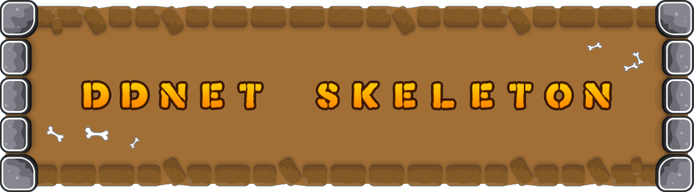

# DDNet-Skeleton

This repository aims to be the skeleton for creating modifications on top of the latest DDNet version. It currently modify the DDNet code so it can support removed vanilla features and comment out the code related to DDRace exclusive functionalities.

## Official Documentation

Documentation for DDNet-Skeleton can be found [here](https://github.com/teemods/ddnet-skeleton-readme).

## Contributing

Thank you for considering contributing to DDNet-Skeleton. All the contribution guidelines are mentioned [here](CONTRIBUTING.md).

## License

DDNet-Skeleton is an open-sourced software licensed under the license at [license.txt](license.txt).
